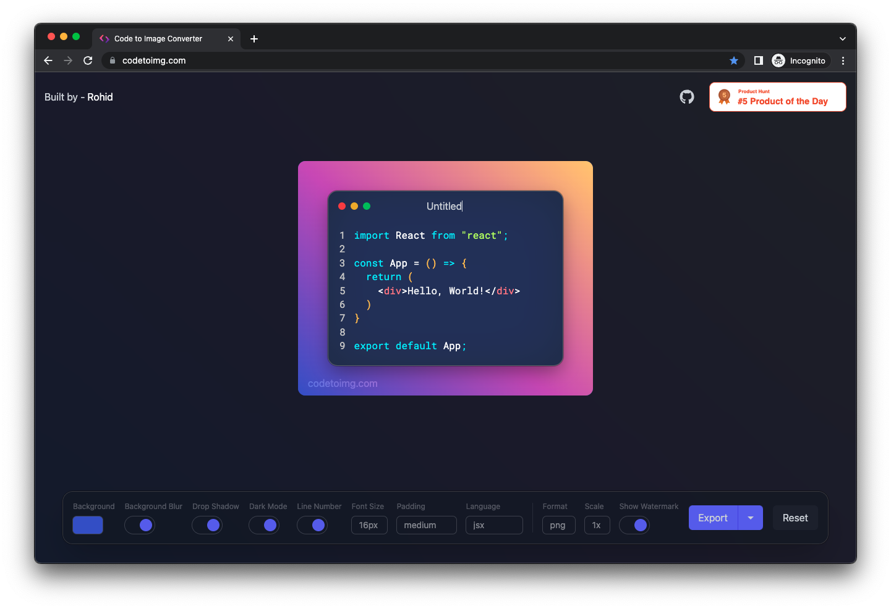

# Code to Image - The shinier code screenshot tool

---

## [Docker Support 🐳](https://www.docker.com/)

If you want a self-hosted deployment, code-to-image supports that too,

1. [Dockerfile](./Dockerfile)
2. [docker-compose](./docker-compose.yaml)

**To deploy using docker, use,**

`docker-compose up -d `
> -d -> Detach from the container after creation.

---
